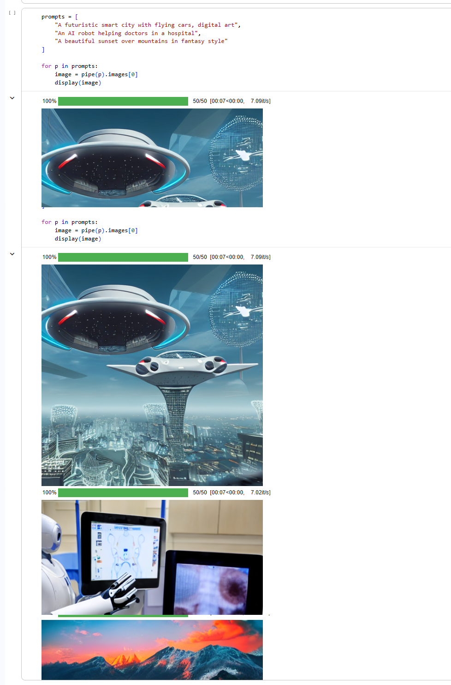

# AI Image Generation (Stable Diffusion)

This project generates images from text prompts using a Stable Diffusion model.  
It shows how AI can convert text into realistic images.

---

## What I did
- Used a pre-trained Stable Diffusion model  
- Entered text prompts  
- Generated images from text  

---

## Tools Used
- Python  
- Google Colab  
- Diffusers Library  

---

## Output

---

## Files
- image_generation_stable_diffusion.ipynb → code  
- output.png → generated image  

---

## Note
This project was done as part of a Generative AI internship.
